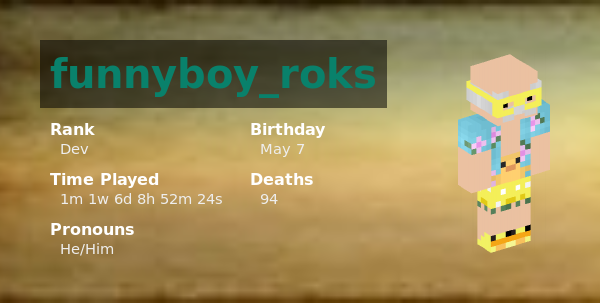

# PlayerCard Generator

A simple thing that will create an image based on provided values

## "Documentation"

Here is some simple "documentation" that's really bad lol

There are a few important things that need to be sent:

- <`name`>
  - The name value is the name of the player, this is used to get the skin, as well as put the name at the top of the card
- \[`color`]
  - This is the colour of the player's name text, default is white.
  - This can be provided in any way that css supports
  - If you want to provide a hexadecimal value, do not put the '#' sign.
- \[`stats`]
  - The stats are the fields that show at under the name.
  - These need to be formatted as `key:value`, separated by commas, look at the example query for an example.

Example:

```
<Address TBD>/playercard
    ?name=funnyboy_roks
    &color=09816b
    &stats=Rank:Dev,Time%20Played:1m%201w%206d%208h%2052m%2024s,Pronouns:He/Him,Birthday:May%207,Deaths:94
```

will get


